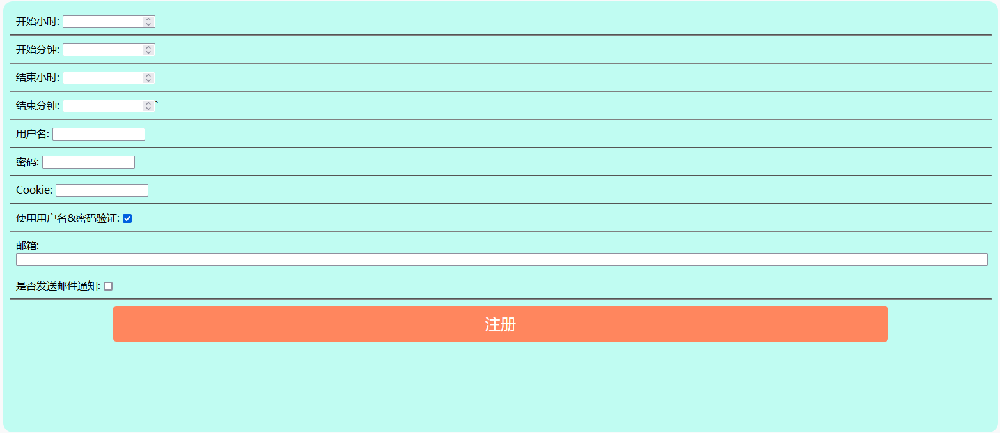
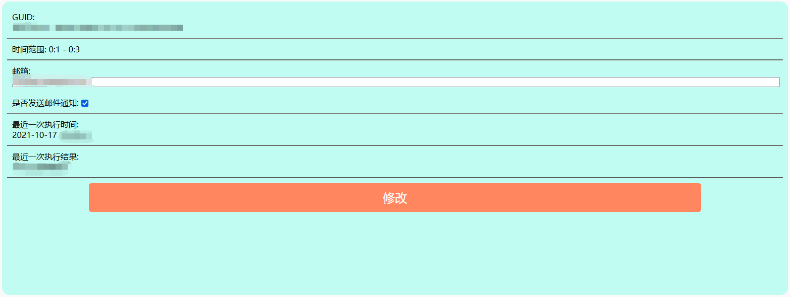
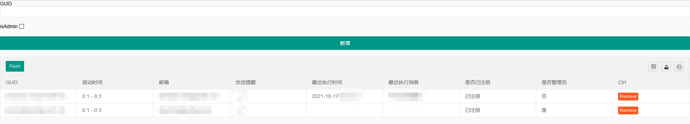

# BUPTReportOnline

> 北京邮电大学疫情通自动填报平台

## 介绍

在老项目[BUPTRushReport](https://github.com/InJeCTrL/BUPTRushReport)的基础上继续推进，后端使用DotNet 5.0开发，跨平台方便部署！

## 相对于老项目的提升

- [x] 无需复杂的payload获取过程，只需用户名&密码或用户Cookie
- [x] 支持用户自定义设置填报时间
- [x] 自动填报时间为浮动范围（每天都在浮动范围内随机）
- [x] 任务执行结果通过邮件形式通知
- [x] 支持在线分发注册资格
- [x] 支持多端查看填报概况

## 使用方法

- 由管理员向用户线下发送包含GUID的链接，用户访问包含GUID的链接后，若未在平台注册，则自动跳转到注册页面

  

  - 开始小时、开始分钟、结束小时、结束分钟：

    每日自动填报的时间 **t** 将在设置的时间范围内随机选择

    **开始小时:开始分钟 <= t <= 结束小时:结束分钟**

  - 用户名、密码：（和Cookie二选一）

    用于登录填报平台的用户名和密码

  - Cookie：（和用户名、密码二选一）

    登录填报平台后存储的Cookie

  - 使用用户名&密码验证：

    若勾选，则表示使用用户名、密码验证身份是否正确，否则使用Cookie进行验证

  - 邮箱：（可选）

    用于接收任务执行结果通知的邮箱

  - 是否发送邮件通知：

    设置是否在任务执行之后向邮箱发送通知

  用户点击注册后，系统将验证用户的鉴权凭证是否正确，若正确则注册成功，跳转到个人配置页面

- 普通用户的配置页面如下

  

  普通用户在此页面只能修改邮箱、是否发送邮件通知两个选项

- 管理员的配置页面如下

  

  管理员页面可以查看所有用户的信息，用户的Cookie不会以任何形式暴露给前端或WebAPI，只用于执行任务存储在数据库中

  目前管理员页面主要实现了用户的新增、用户删除功能，用户信息修改后续完善

- 默认页面

  若用户访问的链接中未包含GUID，或GUID有误，自动跳转到默认的搜索页面

  

  搜索页面中，input内输入正确的GUID并执行搜索，将跳转到相应的用户配置页面，若输入的内容非正确GUID，那么将跳转到Bing搜索对应内容

## 使用技术

- 后端

  DotNet 5.0

  定时任务：FluentScheduler

  邮件服务：MailKit

- 前端UI: LayUI 2.5.7

## 个人部署

1. 安装mysql，并确保可以正常连接mysql

2. 安装[DotNet环境](https://dotnet.microsoft.com/)

3. 下载最新版本release，并解压

4. 进入BUPTReportOnline目录，修改appsetting.json配置文件

   ```json
   {
     "Logging": {
       "LogLevel": {
         "Default": "Information",
         "Microsoft": "Warning",
         "Microsoft.Hosting.Lifetime": "Information"
       }
     },
     "ConnectionStrings": {
       "BROContext": "server=localhost;user id=root;password=;database=BUPTReportOnline;charset=utf8;sslMode=None" // 数据库连接字符串
     },
     "CorsTarget": "xxx",	// 前后端跨域访问，后端设置前端域名URL (eg. https://injectrl.github.io)
     "Config": {
       "FrontEndPrefix": "xxx",	// 前端服务URL前缀 (eg. https://injectrl.github.io/BUPTReportOnline)
       "SrcEMail": "xxx",			// 发件邮箱地址
       "SrcEMailPWD": "xxx",		// 发件邮箱密码
       "EDMPath": "./EDM_template.html",	// 邮件内容模板
       "EMailSubject": "xxx"		// 通知邮件主题
     },
     "AllowedHosts": "*",
     "urls": "http://localhost:5000"		// 后端服务监听的IP:Port
   }
   
   ```

5. 启动BUPTReportOnline

   ```bash
   dotnet BUPTReportOnline.dll &
   ```

## 联系

服务已经部署并开始测试，账号托管或各方面问题可以邮箱方式联系我

dap1933@hotmail.com

## 定时任务方式的选择

起初的想法是使用redis键值对过期机制+发布订阅模式实现定时任务，后发现有问题：

**如果使用过程中redis故障重启，则会导致所有定时任务丢失。如果在redis发布键失效通知时，订阅服务出故障未在线，或者网络问题没有被消费方收到，也会导致此次事件丢失**。

一个任务开一个Timer导致内存占用量大

一个Timer以固定时间间隔检查数据库中的各条记录将导致与数据库方向产生大量IO

所以使用基于时间轮的FluentScheduler